# ***PERSONA***

## **: 야생 조류를 위한 NFT 기부 프로젝트**

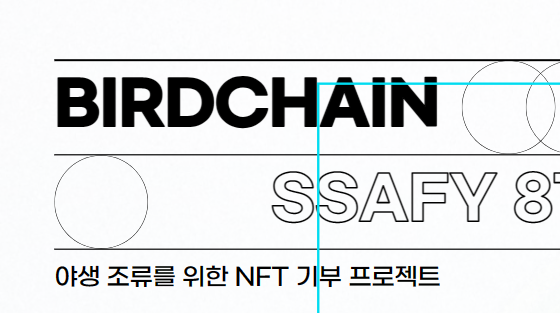

# ✔ Project Summary

### 개발 기간 : 2023.04/10 ~ 2023.05/19

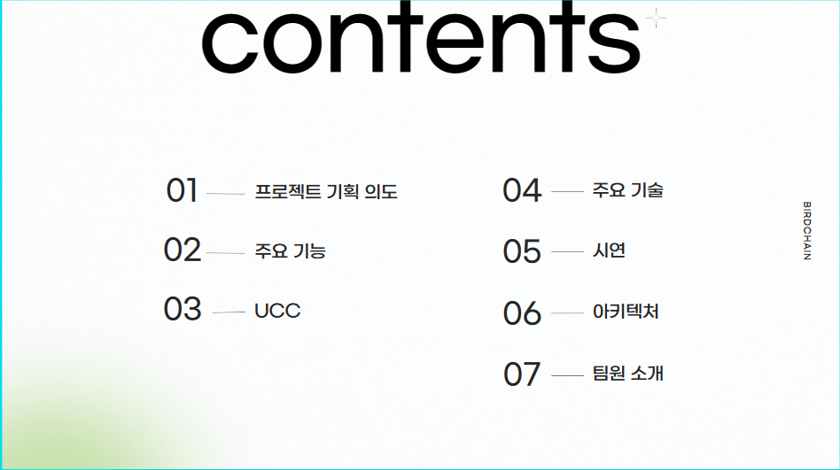

## Back-Ground

- **환경 파괴와 기후 변화로 인해 많은 조류들이 멸종 위기**
환경 파괴와 기후 변화로 인해 많은 조류들이 멸종
이러한 상황에 대한 인식과 조치가 필요

또한 매년 800만 마리가 유리창 충돌, 버드스트라이크가 일어나며
하루 2만마리의 새들이 죽음

## 사용자 요구 분석

- **멸종 위기종을 NFT화하여 이를 홍보하고 기부를 독려**
- **유리창 충돌, 버드스트라이크를 기록**
- **빈번한 사고발생지점에 대한 조치 필요성의 근거를 제공**

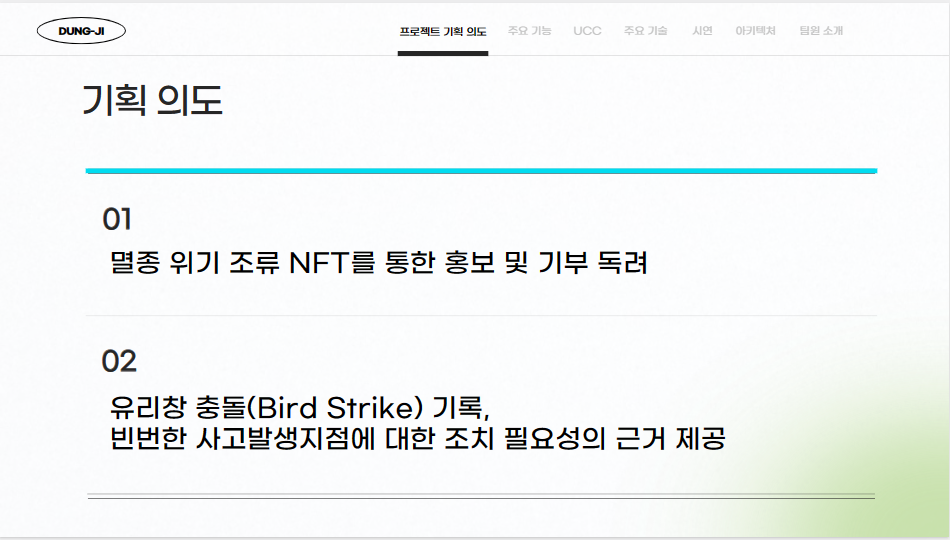

## 서비스 설명

- 멸종 위기종을 NFT화

- 멸종 위기 조류를 안내
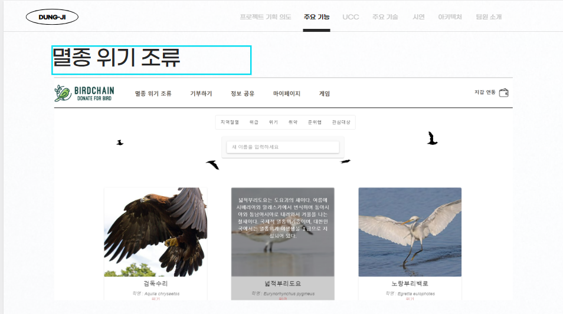

- 유리창 충돌, 버드스트라이크를 기록
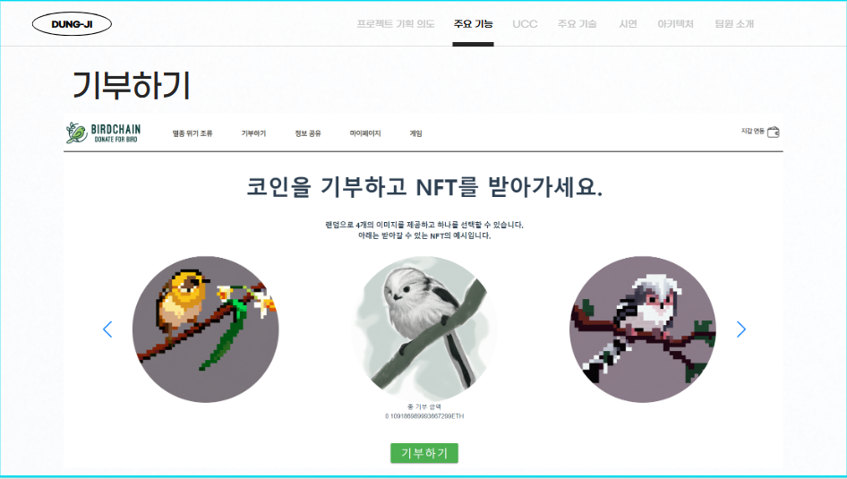

- 기부를 통해 NFT를 발급
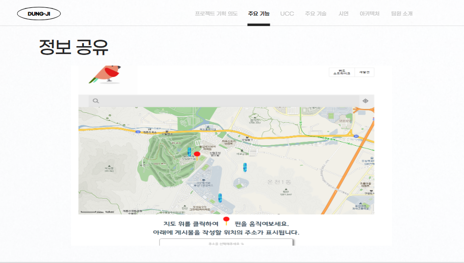

---

## 설계 및 산출물

- **아키텍쳐**

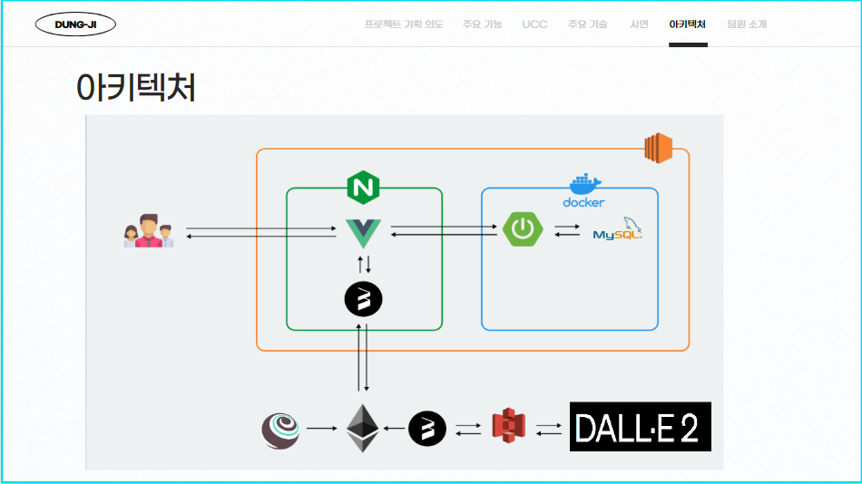

 

## 메인 기능

- 기부를 통해 NFT를 발급
- 멸종 위기 조류를 안내
- 메타마스크 지갑 연동

## 추가 기능

- 조류 위기 인식을 재고 하는 게임
- 커뮤니티

## 메인 기능 설명

- **기부를 통해 NFT를 발급**

- NFT 토큰 발급을 통한 기부 독려

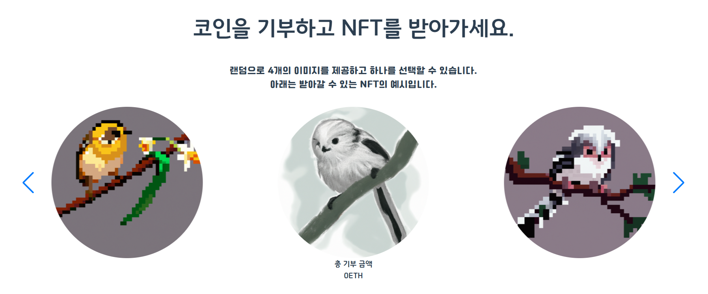

- 지갑 연동후 일정규모의 이더리움 기부

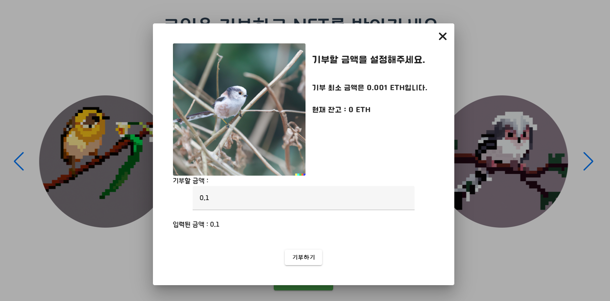

- 원하는 종류의 NFT 토큰 선택

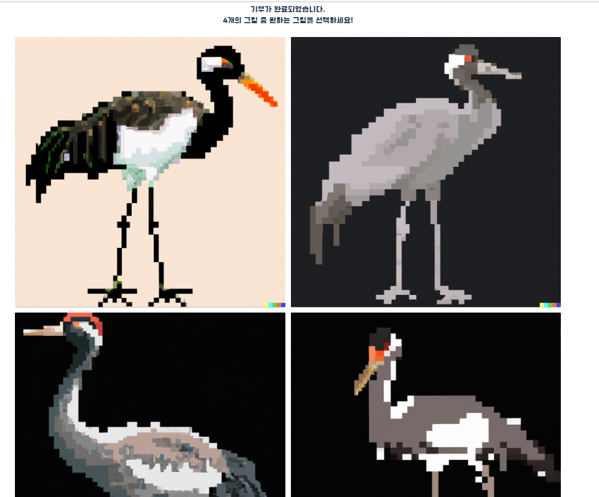

- 발급된 NFT 토큰 확인

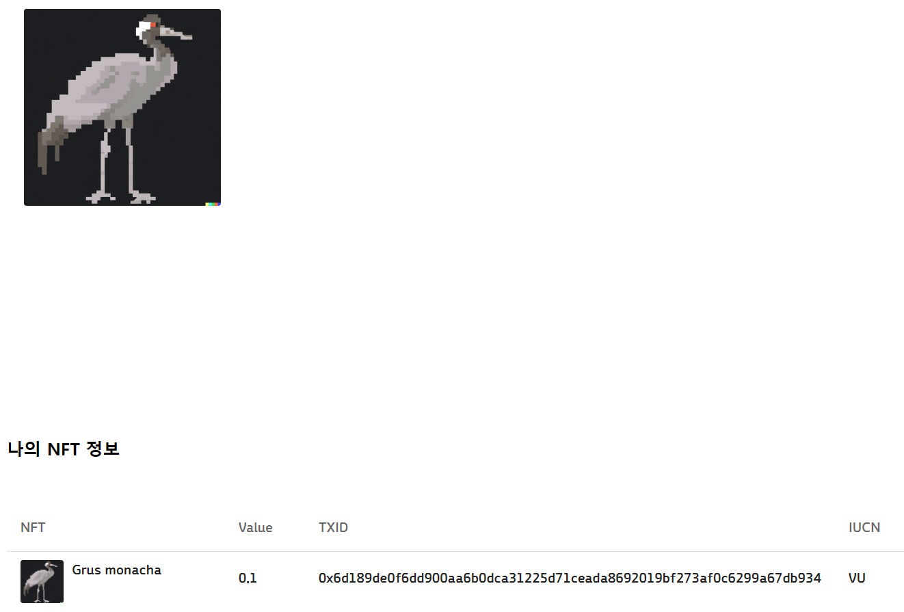

- **멸종 위기 조류를 안내**

- 멸종 위기 조류 데이터 확인

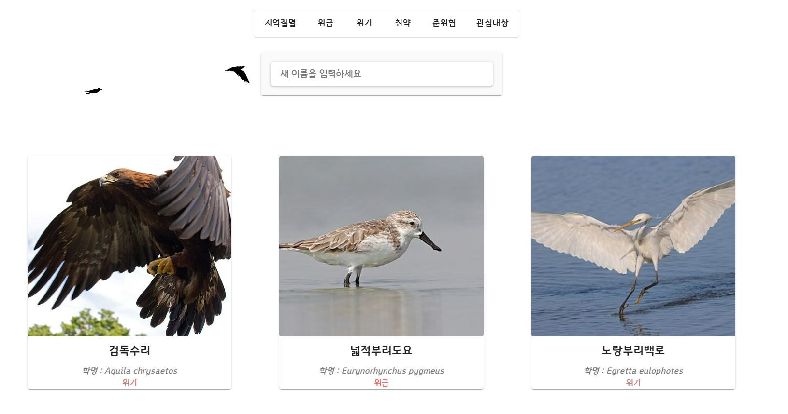

## 기대 효과

- 멸종 위기 조류에 대한 정보 확인

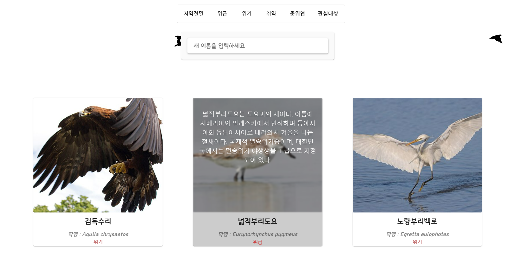

---

-  **게임**

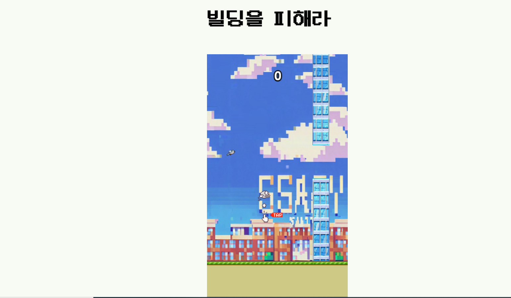

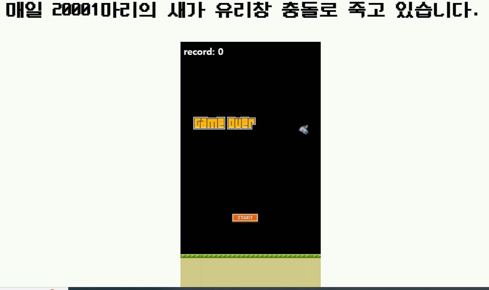

## 사용 기술

- **BlockChain**

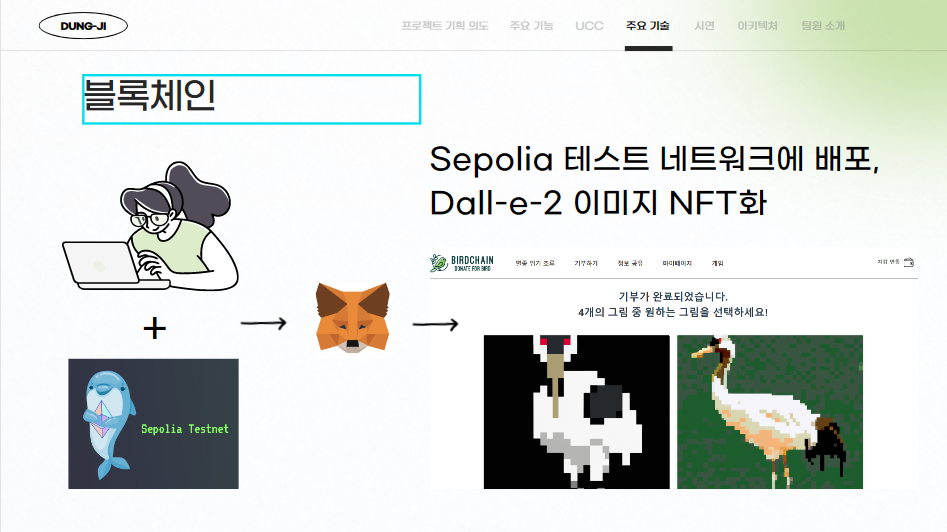

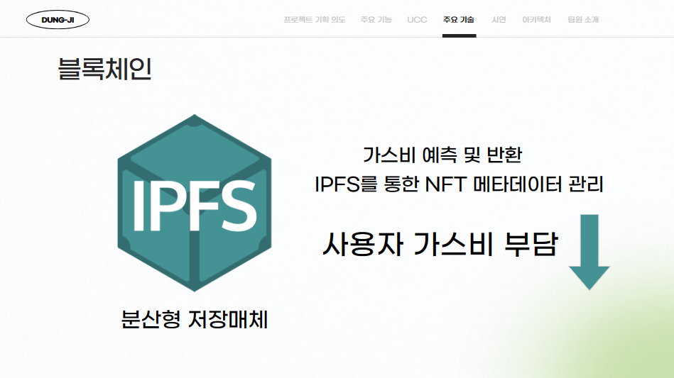

- **PWA**

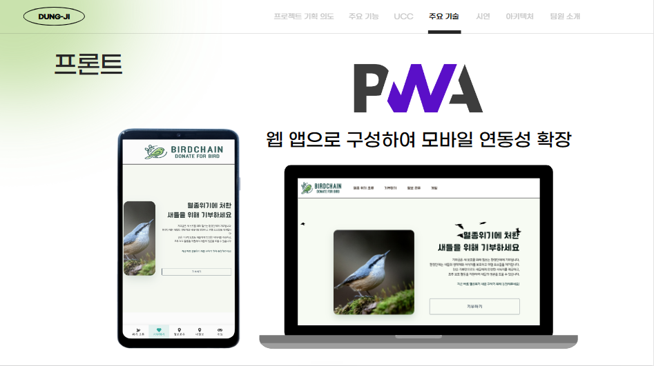

## 개발 환경

---

### **Back-End**

| IntelliJ | ---|
| --- | --- |
| JDK | 11.0.13 |
| SpringBoot | 2.7.8 |
| dependency | 1.0.15 |
| gradle | 7.6 |
| jwt | 0.9.1 |
| JPA |  |

### Front-End

| Node.js | 18.13.0 |
| --- | --- |
| Vue | 3.2.13 |
| VS Code | 1.75.1 |
| Web3 | 1.9.0 |
| Vue-router | 4.1.6 |
| npm | 8.19.3 |
| pinia | 2.0.35 |
| vuetify | 3.1.14 |
| pixi.js | 7.2.4 |

## 배포(CI/CD)

---

- AWS EC2 - ubuntu os 20.04 LTS
- Docker
- Nginx
    - backend , frontend 포워딩 분기 처리
- Jenkins
    - pipeline 스크립트 작성으로 빌드 명령 자동화
    - webhook을 이용한 빌드 유발 자동 배포
- https
    - letsencrypty 인증서 발급(k8b104.p.ssafy.io](https://k8b104.p.ssafy.io/))

# ✔ **Cooperation**

---

## Tools

- Git
- Jira
- Notion
- MatterMost
- Webex

## 팀원 소개

- 김소진 (팀장) - BlockChain
- 조은서 (팀원) - Back-End
- 현승민 (팀원) - Front-End
- 이인호 (팀원) - Front-End
- 강지수 (팀원) - Front-End
- 남기정 (팀원) - BlockChain

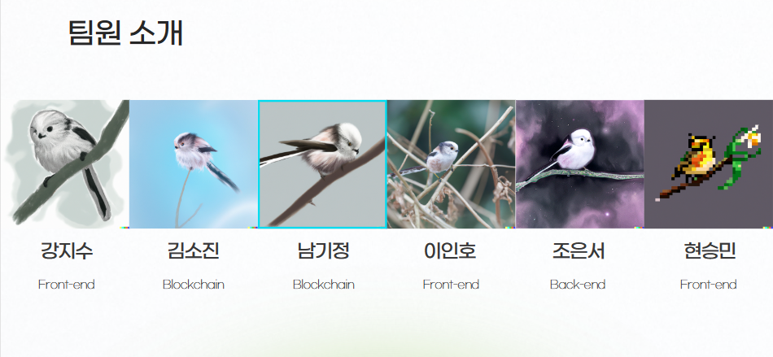